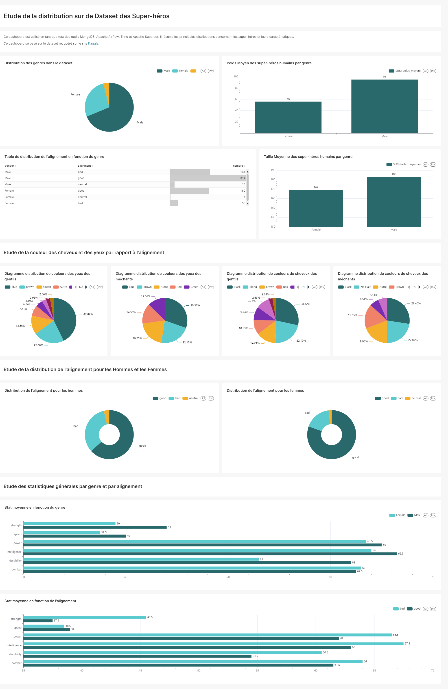
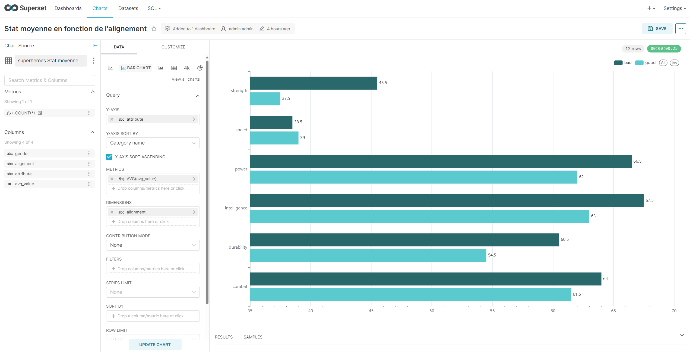
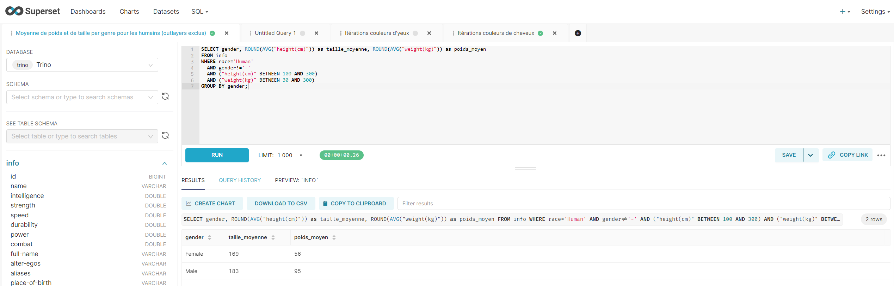

# Projet superheroes

--- 


---

*Scope du projet :*

Ce repo est utilisé pour construire la base de données superheroes en MongoDB (en local) afin de tester l'outil de BI **Apache Superset** pour le compte d'Octime.

La mise en place de ce repo et la documentation se passeront dans ce fichier README.md

--- 

*MongoDB :*

Pour utiliser MongoDB si systemctl ne fonctionne pas en local, on passe par la commande suivante : 

```bash
sudo mongod --dbpath /var/lib/mongodb --logpath /var/log/mongodb/mongod.log --fork
mongosh
```

---

*Trino :*

Pour faire fonctionner Trino, il faut d'abord installer Java (jdk version 23) en cliquant [ici](https://adoptium.net/fr/temurin/releases/?os=linux&arch=x64&package=jdk&version=23)

Extraire le fichier : 
```bash
tar -xvzf trino/OpenJDK23U-jdk_x64_linux_hotspot_23.0.1_11.tar.gz 
```

Télécharger Trino avec ce [lien](https://repo1.maven.org/maven2/io/trino/trino-server/464/trino-server-464.tar.gz)

Extraire le fichier : 
```bash
tar -xvzf trino/trino-server-464.tar.gz
```

<u>Configuration de Trino :</u> 

* Créer un dossier *etc*

* Créer un fichier *etc/config.properties*

```
coordinator=true
node-scheduler.include-coordinator=true
http-server.http.port=8080
query.max-memory=1GB
query.max-memory-per-node=512MB
discovery.uri=http://localhost:8080
http-server.authentication.type=PASSWORD
internal-communication.shared-secret=xBoe+vTz+6e2F62oBUe03EfXqB0X6fRyZD3i9IHFSpM=
http-server.https.enabled=false
http-server.http.enabled=true
http-server.authentication.allow-insecure-over-http=true
```

Cette configuration est telle qu'on peut lancer Apache Superset en HTTP sans SSL.

* Créer un fichier *etc/jvm.config*

```
-Xmx2G
-XX:+UseG1GC
-XX:G1HeapRegionSize=32M
-XX:+ExplicitGCInvokesConcurrent
-XX:+HeapDumpOnOutOfMemoryError
-XX:+ExitOnOutOfMemoryError
```

* Créer un fichier *etc/catalog/mongodb.properties*

```
connector.name=mongodb
mongodb.connection-url=mongodb://localhost:27017
```

Ces fichiers sont à adapter selon votre situation actuelle.

Commandes Trino : 

```bash
# Start Trino
bin/launcher start

# Stop Trino
bin/launcher stop

# Restart Trino
bin/launcher restart

# Check la réponse du serveur
curl http://localhost:8080/v1/statement
```

Pour une authentification par Utilisateur / Mot de passe, consulter [cette page](https://trino.io/docs/current/security/password-file.html)

---

*Apache Superset :*

Pour installer Superset avec pip : 

```bash
# Installer les librairies nécessaires
sudo apt-get install build-essential libssl-dev libffi-dev python3-dev python3-pip libsasl2-dev libldap2-dev default-libmysqlclient-dev

# Upgrade la base de données
superset db upgrade

# Pour les problèmes concernant FLASK dans superset
export FLASK_APP=superset
superset fab create-admin

# Générer une clé SSL de 42 caractères
openssl rand -base64 42

# Ajouter la clé à la variable d'environnement SUPERSET_SECRET_KEY
export SUPERSET_SECRET_KEY="{YOUR_KEY}"

# Creation des roles par défaut
superset init 

# Run Superset
superset run
```

Pour connecter Trino dans Superset, utiliser la chaîne suivante : 

```
trino://{username}@{localhost}:{port}/{catalog_name}
```

--- 

*Apache Airflow :*

```bash
# Installation d'Airflow
pip install apache-airflow

# Attention a bien installer pyarrow pour que les données puissent être stockées en mémoire en différentes tâches
pip install pyarrow

# Lancer Airflow
airflow standalone
```

--- 

*Exemple de dashboard :*

On peut voir un exemple de dashboard créé à partir de cet ETL et d'Apache Superset [ici](https://github.com/Aubin65/superheroes/tree/main/dashboard_example)

Le dashboard peut être exporté en tant qu'image comme ci-dessous : 



Ces graphiques ont été construits depuis le menu "Charts" de l'interface de Superset. Une image de cette interface est présentée ci-dessous : 



Les données de ces graphiques sont quant à elles issues de la base de données MongoDB que nous avons initialement créée. Ensuite, il est possible d'effectuer des requêtes SQL depuis le "SQL lab" d'Apache Superset. Ce menu est de la forme suivante : 


